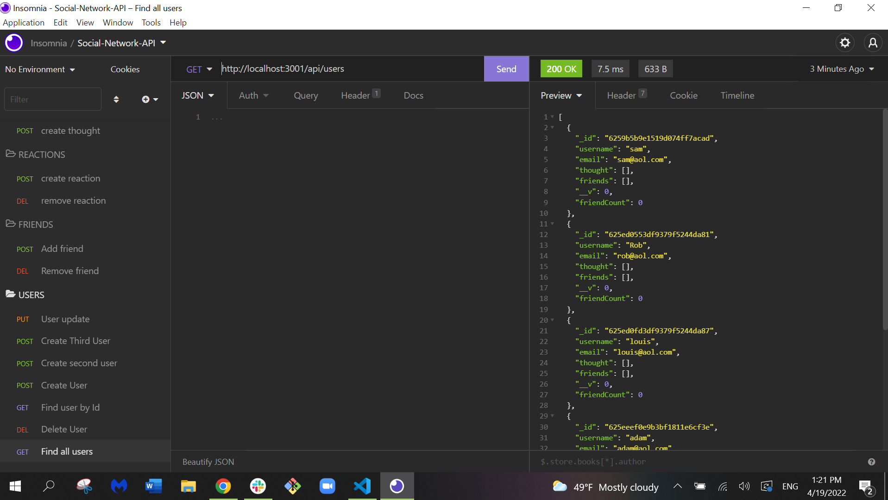
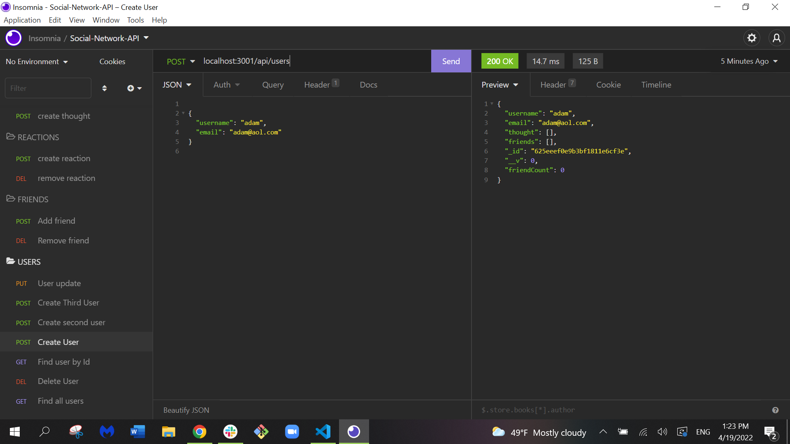

# social-network-api
This project is an api built for the social-network-app where users can share their thoughts and create a list of friends.  

# User Story
AS A social media startup
I WANT an API for my social network that uses a NoSQL database
SO THAT my website can handle large amounts of unstructured data
# Installation
First you must have VS Code or something similar, then you will need to do an npm install, as well as installing mongo db, mongoose, express.js and insomnia to test your routes.
# Usage
It is used for sharing thoughts and ideas with your friends.
# Contributors 
Rebekah818
# links
https://github.com/Rebekah818/social-network-api
https://drive.google.com/file/d/1k0o3kLfEYepiXrxMQLmUOAOIfYEGeVOw/view
https://drive.google.com/file/d/1j6oYa1tgkPyP4gDmoBbAfmpSDqXF60SD/view
# Screenshots

# Table of Contents
Project 
 
Name 
 
User Story
  
Github
 
Installation
  
Usage
 
Contributors
  
Links
 
Screenshots